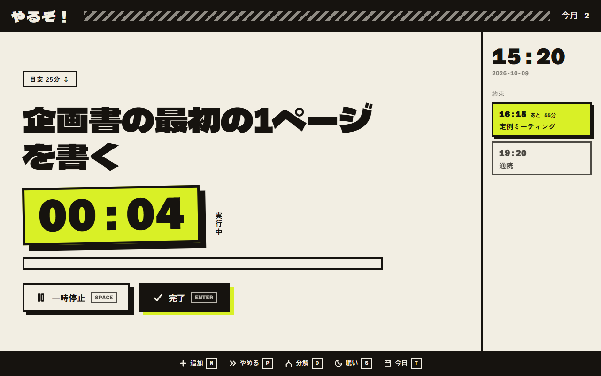

# やるぞ！

ADHD の当事者が「やらなきゃ」から「やり始める」までの一歩を越えるためのアプリです。
タスクを管理するためではなく、手を動かし始めるきっかけを作るために作りました。

画面に出るのは、次にやることの1件だけです。ボタンを押すとタイマーが動き始めます。
アプリの名前は、「やるぞ！」と思ったその瞬間に開いてほしい、という意味を込めて付けています。

- 説明ページ: <https://yaruzo-self.vercel.app/about>
- web 版（ブラウザでそのまま試せます）: <https://yaruzo-self.vercel.app>



## 作った理由

ADHD の脳は「重要だから」という理由では動き出しにくく、興味や新しさ、挑戦、締切の近さといった刺激で動きやすいと言われています（興味ベース神経系）。
一般的な ToDo アプリは「すべてを一覧にして、優先度の高いものから片付ける」ことを前提にしていますが、この特性とは相性がよくありません。

そこで、このアプリでは次のように設計しています。

- やることが全部見えると、量に圧倒されて固まってしまいます。そのため、画面には1件しか表示しません。
- 重要度で並べ替えても動き出すきっかけにはならないため、優先度や重要度という概念自体を持たせていません。
- 1日の計画を立てると、こなせなかった分が「未達」として残ります。そのため、時間割や目標値は作りません。
- 連続記録が途切れると、それが負い目になってアプリを開かなくなりがちです。そのため、連続日数は表示せず、累計の件数だけを数えます。
- 同じ画面にはすぐに飽きてしまうので、完了時のひとことや名言はランダムに変わるようにしています。

設計の根拠と各画面の仕様は [DESIGN.md](DESIGN.md) にまとめています。

## 主な機能

キーボードで操作できます。マウスやタッチでも同じ操作が可能です。

| キー | 操作 |
| --- | --- |
| `Space` | タイマーの開始・一時停止（経過時間を表示します） |
| `Enter` | いまのタスクを完了にする |
| `N` | タスクを追加する |
| `D` | 大きすぎて手が出ないタスクを、3つの小さな手順に分ける |
| `P` | いまのタスクをいったん後回しにして、次のタスクを出す |
| `S` | 眠いときに、歩く・水を飲む・顔を洗うといった体を動かすタスクを出す |
| `T` | 今日の記録を開く（完了したタスク、累計の件数、起床時刻、朝に光を浴びたか、今日の予定） |
| `Esc` | 開いている画面を閉じる |

そのほかの機能は次のとおりです。

- **表示される順番**: 登録が古いものから順に表示します。気が乗らないときは `P` で次に送れます。
- **定番**: 歯磨きや日報のように繰り返すことを登録しておくと、追加画面からワンタップで追加できます。
- **目安時間**: タスクの目安時間は、バッジを上下にドラッグする（または上下キーを押す）と5分単位で変えられます。
- **今日の約束**: 会議や通院、締切など、自分では動かせない今日の予定を登録できます。画面の右側に時刻順で並び、次の予定までの残り時間が表示されます。タスクとは結び付けず、予定どおりにできたかどうかも記録しません。

### あえて入れていない機能

優先度による並べ替え、タグやフィルタ、カレンダー連携、連続記録、達成率のグラフ、通知や催促、ログインや端末間の同期、設定画面は入れていません。
いずれも管理の手間を増やすか、できなかったことへの負い目を生むためです。詳しくは [DESIGN.md](DESIGN.md) の7章に書いています。

## インストール

使い方は2通りあります。

- **web 版**: <https://yaruzo-self.vercel.app> をブラウザで開けば、インストールなしで使えます。
- **デスクトップアプリ（Windows）**: 普段使いにはこちらをおすすめします。ブラウザのタブに埋もれず、スタートメニューから1回で起動できます。

### デスクトップアプリを入れる

1. [Releases](https://github.com/N-Hayashi-v8/yaruzo/releases/latest) を開き、`yaruzo_<バージョン>_x64-setup.exe` をダウンロードします。
2. ダウンロードしたファイルを実行します。
3. スタートメニューに「やるぞ！」が追加されます。次からはそこから起動できます。

インストーラには電子署名をしていないため、実行時に「Windows によって PC が保護されました」という警告が出ることがあります。その場合は「詳細情報」→「実行」を選んでください。
アンインストールは、Windows の「設定」→「アプリ」から行えます。

## データの保存先

データはすべて、お使いのブラウザ（またはデスクトップアプリ）の中にある IndexedDB に保存されます。
サーバーやアカウント、外部サービスは使っていません。そのため、別の端末にデータは引き継がれません。
web 版とデスクトップアプリのデータも別々に保存されるので、片方で登録したタスクはもう片方には出ません。

## 開発環境で動かす

Node.js が必要です。テストで TypeScript ファイルを直接実行しているため、v24 以降を使ってください。

```bash
npm install
npm run dev     # http://localhost:3000 で開きます
```

### デスクトップアプリ

デスクトップアプリ化には [Tauri](https://tauri.app/) を使っています。手元でビルドするには、Rust と Microsoft C++ Build Tools も必要です（導入手順は [SETUP.md](SETUP.md) の1章にあります）。

```bash
npm run tauri dev     # アプリの窓で開発サーバーを開く
npm run tauri build   # インストーラを作る（src-tauri/target/release/bundle/nsis/）
```

macOS と Linux でもビルドできる構成にはなっていますが、動作は確認していません。

### リリース

`src-tauri/tauri.conf.json` の `version` と同じ名前のタグ（例: `v0.1.0`）を push すると、GitHub Actions が Windows 用インストーラをビルドして Releases に載せます（[.github/workflows/release.yml](.github/workflows/release.yml)）。

```bash
git tag v0.1.0
git push origin v0.1.0
```

### テストとチェック

```bash
npm test        # テスト
npm run lint    # 静的解析
npm run build   # ビルド
```

## 技術構成

- Next.js（App Router、静的エクスポート）、TypeScript、Tailwind CSS
- データの保存: IndexedDB
- デスクトップアプリ: Tauri 2
- web 版の公開: Vercel

```text
app/page.tsx             メイン画面
app/overlays.tsx         追加・分解・眠い・今日の各画面
lib/types.ts             データの型定義
lib/store.ts             IndexedDB の読み書き
lib/select.ts            次に表示するタスクを選ぶ処理
lib/quotes.ts            名言のデータ
public/about/index.html  説明ページ（/about）
src-tauri/               デスクトップアプリ用の設定とコード
```

## ドキュメント

- [DESIGN.md](DESIGN.md): 設計の根拠、各画面の仕様、あえて作らないものの一覧
- [SETUP.md](SETUP.md): 開発環境の構築手順、別の PC への移行手順
- [CLAUDE.md](CLAUDE.md): AI コーディングアシスタント向けの開発ルール
- `AGENTS.md`: Next.js が自動で生成するファイル

## ライセンス

[MIT](LICENSE)
